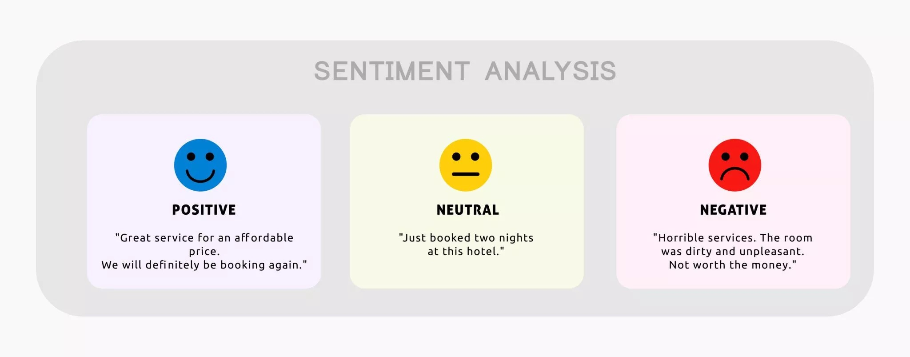

```{r setup, include=FALSE}
# fig.align = "center" as a knitr option does not work. Must be included in each chunk.
knitr::opts_chunk$set(echo = FALSE, message = FALSE, warning = FALSE)
```

```{r libraries}
library(dplyr)
library(ggplot2)
library(scales)
library(GGally)
library(SentimentAnalysis)
library(ggrepel)
library(gridExtra)
library(grid)
```

```{r color_options}
color1 = "blue"
palette1 = "Set1"
```


# Data

## Introduce the data

### The sitcom

We're going to explore data from a well-known U.S. sitcom that aired from 2005 to 2013. Any guesses?

\pause

```{r shows_posters, out.height="70%", fig.show="hold", fig.align="center"}
knitr::include_graphics('i2_office_poster.jpg')
```

### The data

Our data come from the [\textcolor{blue}{The Office Episodes Data}](https://www.kaggle.com/datasets/bcruise/the-office-episodes-data) which is available on Kaggle. The data were read into `R` as a data frame. Let's take a look at the columns available for analysis.

\pause

\tiny
```{r load_data, fig.width = 10}
# Load data
dat = read.csv("office.csv")

# Convert variable types
dat$air_date = as.Date(dat$air_date, "%m/%d/%y")
dat$season = as.factor(dat$season)

# Show data structure
str(dat, vec.len = 1.4, nchar.max = 96)
```

\normalsize

### Data familiarity

It's appropriate to familiarize oneself with the data before embarking on any kind of analysis. As such, we would be wise to do some eyes-on data familiarization by watching  [\textcolor{blue}{a short clip}](https://www.yout-ube.com/watch?v=gO8N3L_aERg) from a representative episode of *The Office*.  


## Explore the data

### U.S. viewership per episode

```{r viewership, fig.height=6, fig.width = 10}
ggplot(data = dat) +
  geom_point(aes(x = air_date, y = us_viewers, fill = season), shape = 21, size = 3, alpha = 0.75) +
  scale_fill_brewer(palette = palette1) +
  labs(
    x = "Episode air date\n",
  ) +
  scale_y_continuous(name="Episode viewership", labels = comma) +
  theme(legend.position="right", 
        axis.text=element_text(size=16),
        axis.title=element_text(size=18,face="plain"),
        legend.title = element_text(size = 18, face = "plain"),
        legend.text = element_text(size = 16)) 

```

### U.S. viewership per episode

```{r viewership_label, fig.height=6, fig.width = 10}
# Add text labels
dat$plot_label = ""
dat$plot_label[78] = "Aired immediately following Superbowl XLIII"

ggplot(data = dat, aes(x = air_date, y = us_viewers)) +
  geom_point(aes(fill = season), shape = 21, size = 3, alpha = 0.75) +
  scale_fill_brewer(palette = palette1) +
  labs(
    x = "Episode air date\n",
  ) +
  scale_y_continuous(name="Episode viewership", labels = comma) +
  theme(legend.position="right", 
        axis.text=element_text(size=16),
        axis.title=element_text(size=18,face="plain"),
        legend.title = element_text(size = 18, face = "plain"),
        legend.text = element_text(size = 16)) +
  geom_label_repel(aes(label = plot_label),
                   fill = "light green", color = 'black',
                   size = 3.5, 
                   arrow = arrow(length = unit(0.25, 'cm')),
                   box.padding = unit(2, 'lines'), 
                   point.padding = unit(1.5, 'lines'),
                   seed = 13)


```

### Average IMDB rating per episode

```{r imdb_rating, fig.height=6, fig.width = 10}
ggplot(data = dat) +
  geom_point(aes(x = air_date, y = imdb_rating, fill = season), shape = 21, size = 3, alpha = 0.75) +
  scale_fill_brewer(palette = palette1) +
  labs(
    x = "Episode air date\n",
  ) +
  scale_y_continuous(name="IMDB avg rating", labels = comma) +
  theme(legend.position="right", 
        axis.text=element_text(size=16),
        axis.title=element_text(size=18,face="plain"),
        legend.title = element_text(size = 18, face = "plain"),
        legend.text = element_text(size = 16))
```


### Average IMDB rating per episode

```{r imdb_rating_label, fig.height=6, fig.width = 10}
ggplot(data = dat) +
  geom_point(aes(x = air_date, y = imdb_rating, fill = season), shape = 21, size = 3, alpha = 0.75) +
  scale_fill_brewer(palette = palette1) +
  labs(
    x = "Episode air date\n",
  ) +
  scale_y_continuous(name="IMDB avg rating", labels = comma) +
  theme(legend.position="right", 
        axis.text=element_text(size=16),
        axis.title=element_text(size=18,face="plain"),
        legend.title = element_text(size = 18, face = "plain"),
        legend.text = element_text(size = 16)) +
  geom_vline(xintercept = as.Date("9/1/11", "%m/%d/%y"), linetype = "dashed", linewidth = 1.5) +
  geom_text(x = as.Date("7/25/11", "%m/%d/%y"), y = 8, size = 4,
            #label = expression("Steve Carell leaves" ~ italic("The Office") ~ "after Season 7"),
            label = "Steve Carell leaves after Season 7",
            face = "plain",
            angle = 90)
```


# Bootstrap methods with IMDB ratings

### Exploring IMDB ratings further

Suppose IMDB avg ratings were our benchmark for episode quality or performance. We'll use these ratings as our variable of interest for today's examples. First, let's take a look at the distribution of IMDB avg ratings.

\tiny
```{r summary()}
# summary(dat$imdb_rating)
```
\normalsize

```{r ratings_histogram, fig.width = 10, fig.height = 4, fig.align = "center"}
# Plot histogram
ggplot(data = dat) +
  geom_histogram(aes(x = imdb_rating), col = "black", fill = "steel blue", breaks = seq(from = 6, to = 10, by = 0.25), alpha = 0.6) +
  geom_vline(aes(xintercept = mean(dat$imdb_rating), color = "mean"), size = 1.5, linetype = "dashed") +
  labs(
    x = "IMDB avg rating",
    y = "Number of episodes",
    caption = "Notice the red line represents an average of averages."
  ) +
  scale_color_manual(name = "Sample mean", values = c(mean = "tomato"), labels = c(bquote(bar(x) == .(round(mean(dat$imdb_rating),2))))) +
  theme(axis.text=element_text(size=16),
        axis.title=element_text(size=18,face="plain"),
        legend.title = element_text(size = 18, face = "plain"),
        legend.text = element_text(size = 16))
```

### Some throat clearing
It's worth addressing a few peculiarities about doing statistical inference on the IMDB average ratings. Before I share my concerns, what concerns would you have about doing statistical inference on this data?
\newline

\pause
|   1. We're working with a population dataset. 
|           *What value is there in doing inference with population data?*
|
|   2. Each observation is itself an average. 
|           *What would it mean to build a confidence interval for, say, the mean*
|           *value of IMDB average ratings?*
|
|   3. The observations are not independent. 
|           *To what degree might this degrade our analysis?*


### Checking independence of observations
```{r independence, fig.align="center", fig.height = 6, fig.width = 10}
# Build data frame
indy = data.frame(Rating = dat$imdb_rating[-1], Previous = dat$imdb_rating[-188])

# Compute correlation
indy_cor = with(indy, round(cor(Previous, Rating),3))

# Create plot
ggplot(data = indy) +
  geom_point(aes(x = Previous, y= Rating), fill = "steel blue", shape = 21, size = 3, alpha = 0.75) +
  scale_fill_brewer(palette = palette1) +
  labs(
    x = "Episode rating",
    y = "Next episode rating",
    title = bquote("Correlation between episode rating and next episode rating is" ~ .(indy_cor) * ".")
  ) +
  theme(legend.position="right", 
        title = element_text(size = 16, face = "plain"),
        axis.text=element_text(size=16),
        axis.title=element_text(size=18,face="plain"),
        legend.title = element_text(size = 18, face = "plain"),
        legend.text = element_text(size = 16))
```


## Permutation tests for comparing groups 

### The Michael Scott effect

We saw previously that ratings dropped when Steve Carell left *The Office*. Suppose we were to partition our data into 

1. Episodes whose episode descriptions do reference Michael
2. Episodes whose episode descriptions do NOT reference Michael

\pause
Here's an episode description of an episode which would belong to the first group.
\
\

>> Dwight's too-realistic fire alarm gives Stanley a heart attack. When he returns, Michael learns that he is the cause of Stanley's stress. To remedy the situation, he forces the office to throw a roast for him.
\
\

Would you expect to see a noticeable difference in IMDB average ratings between the two groups?


### The Michael Scott effect 

```{r michael_eps}
# Add michael indicator variable
dat$michael_ep = grepl("Michael", dat$description, fixed = TRUE)
```

```{r density_michael}
# Create density plot
density_m = ggplot(data = dat, aes(x = imdb_rating, group = michael_ep, fill = michael_ep)) +
  geom_density(adjust = 1.2, alpha = 0.6) +
  scale_fill_discrete(labels = c("No", "Yes"),
                      name = "Episode description references Michael?") +
  labs(
    x = "IMDB average rating",
    y = "Density"
  ) +
  theme(legend.position="top", 
        axis.text=element_text(size=12),
        axis.title=element_text(size=14,face="plain"),
        legend.title = element_text(size = 11, face = "plain"),
        legend.text = element_text(size = 11)) 

#density_m
```

```{r box_michael}
box_m = ggplot(data = dat, aes(x = michael_ep, y = imdb_rating, fill = michael_ep)) +
  geom_boxplot(alpha = 0.6) +
  labs(
    x = "Episode description references Michael?",
    y = "IMDB average rating",
    title = ""  # to make top of plots align
  ) +
  scale_x_discrete(labels = c("No","Yes")) +
  theme(legend.position="none", 
        title = element_text(size = 30, face = "plain"), # To make top of plots align
        axis.text=element_text(size=12),
        axis.title=element_text(size=14,face="plain"),
        legend.title = element_text(size = 12, face = "plain"),
        legend.text = element_text(12)) +
  coord_flip()

#box_m
```

```{r arrange_hist_box, fit.width = 10, fig.height = 6}
# Layout matrix
mymat <- matrix(c(1, 2), 
                nrow = 1, ncol = 2,
                byrow = TRUE)
layout(mat = mymat)

# plots
grid.arrange(box_m, density_m, 
        ncol=2, nrow=1, widths=c(8, 8))
```

\small
Note: `r sum(dat$michael_ep)` of the 188 episodes have descriptions which make reference to Michael.
\normalsize

### The Michael Scott effect

We might want to know
\
\

> Are these differences in ratings statistically significant? Or, could they just be attributed to just "noise" in the data?
\
\

Based on your knowledge of statistics, how would you answer these questions?

### The traditional approach

Let $\mu_M$ be the population mean of IMDB average ratings for episodes whose episode descriptions refer to Michael. Let $\mu_N$ be the population mean of IMDB average ratings for all other episodes. Then we can test the following hypotheses
\
\

$$
\begin{aligned}
H_0: &~~ \mu_M = \mu_N \\
H_A: &~~ \mu_M > \mu_N \\
\end{aligned}
$$
\
\

using a $t$-test for difference of means. 

### The traditional approach

**What are the mechanics of the $t$-test for difference of means?**
\pause

1. Assume the observations are independent, normally distributed random variables with means $\mu_k$ and roughly equal variances $\sigma^2_k$ for groups $k\in\{M,N\}$. That is, assume each observation, $x_i$, has the following probability density function.

$$
f(x_i) = \frac{1}{\sqrt{2\pi\sigma_k^2}} e^{-\frac{1}{2}\frac{(x_i-\mu_k)^2}{\sigma_k^2}}
$$
\pause

2. Compute point estimate $\bar{x}_M - \bar{x}_N$, where $\bar{x}_k$ is the sample mean of group $k$. 
\pause

3. Compute the standard error of the point estimate, 
$$
\text{SE}_{\bar{x}_M-\bar{x}_N} = \sqrt{\frac{\sigma_M^2}{n_M} + \frac{\sigma_N^2}{n_N}} \approx \sqrt{\frac{s_M^2}{n_M} + \frac{s_N^2}{n_N}}
$$
where $s_k^2$ is the sample variance and $n_k$ is the sample size of group $k$.

### The traditional approach

**What are the mechanics of the $t$-test for difference of means?** (continued)

4. Compute the test statistic,
$$
t^* = \frac{\bar{x}_M - \bar{x}_N}{\text{SE}_{\bar{x}_M-\bar{x}_N}}.
$$
\pause

5. Note that given our assumptions, $t^*$ follows a student-$t$ distribution with 

$$
v = \frac{\left( \frac{s^2_M}{n_M} + \frac{s^2_N}{n_N} \right)^2}{\frac{s^4_M}{n^2_M\left(n_M-1 \right)} + \frac{s^4_N}{n^2_N\left(n_N-1 \right)}}
$$
\begin{itemize}
  \item[] degrees of freedom.
\end{itemize}

### The traditional approach

**What are the mechanics of the $t$-test for difference of means?** (continued)

5. ...That is, given our assumptions, our test statistic will have the following probability density function.

$$
f(t^*) = \frac{\Gamma\left( \frac{v+1}{2} \right)}{\sqrt{v\pi} \Gamma \left( \frac{v}{2} \right)} \left(1+\frac{t^{*^2}}{v} \right) ^ {- \frac{v+1}{2}}
$$
\pause

6. Compute $\text{p-value} = \text{P}\left(t > t^* \right)= \int_{t^*}^\infty f(t)dt$ where $f(\cdot)$ is the probability density function for a student-$t$ distribution with $v$ degrees of freedom.

\pause
\begin{itemize}
  \item[7.] Use the $\text{p-value}$ to evaluate $H_0$ vs. $H_A$. This is often done by comparing the $\text{p-value}$ to some previously agreed upon significance level, $\alpha$.
\end{itemize}

### The traditional approach

```{r t_test}
# Extract numeric values
mdat = subset(dat, michael_ep == TRUE)$imdb_rating
ndat = subset(dat, michael_ep == FALSE)$imdb_rating

# Run t test
ttest = t.test(mdat, ndat, alternative = "greater")
```

```{r t_plot, fig.width=10, fig.height=3}
# Extract test stat, p value, and degrees of freedom
tteststat = ttest$statistic
tpvalue = ttest$p.value
tdf = ttest$parameter

# Create x and y values for density
x1 = seq(from = -7, to = 7, by = 0.01)
y1 = dt(x = x1, df = tdf)
tplotdat = data.frame(x1,y1) 

# Create plot
ggplot(data = tplotdat, aes(x = x1, y = y1)) + 
  geom_line(col = "steel blue", size = 1.5) +
  geom_area(fill = "steel blue", alpha = 0.5) +
  labs(x = bquote(t),
    y = "Density",
    title = bquote("Student-t distribution with" ~ v == .(round(tdf,1)) ~ "degrees of freedom")
  ) +
  geom_vline(aes(xintercept = tteststat, col = "test_stat"), size = 1.5, linetype = "dashed") +
  scale_color_manual(name = "Test statistic", values = c(test_stat = "tomato"), labels = c(bquote("t*" == .(round(tteststat,2))))) +
  theme(legend.position="right", 
        title = element_text(size = 16, face = "plain"),
        axis.text=element_text(size=16),
        axis.title=element_text(size=18,face="plain"),
        legend.title = element_text(size = 16, face = "plain"),
        legend.text = element_text(size = 16)) 
  
```

```{r sample_means}
xbardiff = mean(mdat) - mean(ndat)
```

\small
Using the traditional approach, we compute

$$
\text{p-value} = \text{P}\left(t > t^* \right)= \int_{t^*}^\infty f(t)dt \approx 9.199 \times 10^{-9} \approx 0. 
$$
\pause
That is, given all the aforementioned assumptions, the probability we would observe a difference in sample means $\bar{x}_M - \bar{x}_N$ as large or larger than what we actually observed if $H_0: ~ \mu_M = \mu_N$ were in fact true is nearly $0$. There is statistically significant evidence for the "Michael Scott effect". 
\normalsize

### A computational approach: Permutation Test

A different approach and the logic behind it: \pause

- Suppose there really were no "Michael Scott effect." That is, suppose that the distribution of IMDB average ratings were the same between the two groups, and the observed difference is just due to chance. \pause
- Under this assumption, any partition of the $188$ IMDB average ratings into two groups of size $n_M = 128$ and $n_N=60$ would be equally probable to any other such partition. \pause
- Theoretically, we could compute the difference in sample means of IMDB average ratings we *would* observe under each of these partitions. This would give us a distribution of all the possible differences in means one *would* expect to see *if* there really were no "Michael Scott effect." \pause
- Now, if the real, observed difference is unusually large (i.e., highly improbable) relative to the distribution of possible differences, then we have evidence against the hypothesis that there is no "Michael Scott effect."

### A computational approach: Permutation Test

Let's formalize this by defining and reviewing some terms. Let 

- $x_i$ be the IMDB average rating of episode $i$. \pause
- $E =\{1,2,...,188\}$ be the set of all episode numbers. \pause
- $M$ and $N$ be the subsets of episode numbers with and without descriptions which refer to Michael, respectively. \pause
- $n_E = n_M + n_N = 128 + 60 = 188$ be the total number of episodes. \pause
- $\bar{x}_M = \frac{1}{n_M} \sum_{i \in M} x_i$ and $\bar{x}_N = \frac{1}{n_N} \sum_{i \in N} x_i$ be the sample means of IMDB average ratings for the two groups of interest. \pause
- $\bar{d} = \bar{x}_M - \bar{x}_N$. \pause
- $n_B = \binom{n_E}{n_M} = \frac{n_E!}{n_M!n_N!} = \frac{188!}{128!60!} = 8.401164\times 10^{49}$ be the number of ways you can partition the elements of $E$ into two subsets of size $n_M$ and $n_N$. \pause
- $B$ be the set of all $n_B$ possible partitions of the elements of $E$ into two subsets of size $n_M$ and $n_N$. The $j$th element of $B$ is $\{M_{(j)}^*, N_{(j)}^*\}$, the subsets to which the elements of $E$ are partitioned. 

### A computational approach: Permutation Test

The procedure for the permutation test is as follows.
\
\

\begin{tt}
{\bf for} $j=1...n_B$ {\bf do} \\
$\qquad \bar{x}^{*}_{M,j} = \frac{1}{n_M} \sum_{i \in M_{(j)}^*} x_i$ \\
$\qquad \bar{x}^{*}_{N,j} = \frac{1}{n_N} \sum_{i \in N_{(j)}^*} x_i$ \\
$\qquad \bar{d}^*_j = \bar{x}^{*}_{M,j} - \bar{x}^{*}_{N,j}$ \\
{\bf end for} \\
$\qquad$\\
$\text{p-value} = \frac{1}{n_B} \sum_{j=1}^{n_B} I_{\bar{d}^*_j > \bar{d}}$ \\
\end{tt}
\

Translation: Loop through every possible partition of the episodes into $n_M=128$ and $n_N=60$ episodes, and compute the difference in sample means. Compare the true difference in sample means to the distribution of possible differences under the no-Michael-Scott-effect assumption. \pause 
**Do you see any potential technical problems with this approach?**

### A computational approach: Permutation Test

\small
In practice, we don't loop through all possible partitions. Instead, we build the reference distribution with some sufficiently large number of partitions. For example,

$\qquad$
\pause

```{r permutation_test}
B = 10000
nE = nrow(dat)
nN = length(ndat)
xbarM = numeric(B)
xbarN = numeric(B)
d = numeric(B)
for (j in 1:B){
  episode_sample = sample(1:nE, size = nN, replace = FALSE)
  xbarM[j] = mean(dat$imdb_rating[-episode_sample])
  xbarN[j] = mean(dat$imdb_rating[episode_sample])
}
d = xbarM - xbarN
pdat = data.frame(xbarM, xbarN, d)
rdat = data.frame(xbarM = mean(mdat), xbarN = mean(ndat), rd = mean(mdat) - mean(ndat))
p.value = sum(pdat$d > d) / B
```

```{r ptest_hist, fig.height = 4, fig.width = 10}
phist = ggplot(dat = pdat) +
  geom_histogram(aes(x = d), col = "black", fill = "steel blue", breaks = seq(from = -0.6, to = 0.6, by = 0.05), alpha = 0.6) +
  geom_vline(aes(xintercept = rdat$rd, color = "mean"), size = 1.5, linetype = "dashed") +
  labs(
    x = expression(bar(x)[M]^{"*"} - bar(x)[N]^{"*"}),
    y = "Number of simulations",
    title = expression("10,000 simulated values of" ~ bar(x)[M]^{"*"} - bar(x)[N]^{"*"} ~ "under" ~ H[0]),
    subtitle = bquote("The p-value for this test is" ~ .(p.value))
  ) +
  scale_color_manual(name = "Real world difference", values = c(mean = "tomato"), labels = c(bquote( bar(x)[M] - bar(x)[N] == .(round(rdat$rd, 3))))) +
  theme(legend.position = "right",
        axis.text=element_text(size=16),
        axis.title=element_text(size=18,face="plain"),
        legend.title = element_text(size = 18, face = "plain"),
        legend.text = element_text(size = 16),
        plot.title = element_text(size = 18),
        plot.subtitle = element_text(size = 16))

phist
```


Note: Each of the 10,000 partitions is formed by random sampling $n_M = 128$ of the IMDB avg ratings without replacement. Those selected form the first group; the remaining $n_N = 60$ ratings form the second. 
\normalsize

## Standard error approximation for sample correlation

### Sentiment analysis

We've found statistically significant evidence for the "Michael Scott effect." What other information might we use to explain the variance in the IMDB average ratings? 

\

Here I thought it would be interesting to explore a sentiment analysis of the episode scripts. Do more positive or negative episode scripts correlate to IMDB average ratings?

\

This is not a presentation about sentiment analysis. Real quickly, has anyone here heard of it?

### Sentiment analysis

```{r shows_SA_graphic, out.height="70%", fig.align="center"}

```

### Sentiment analysis

```{r read_lines}
# Read in lines
lines = read.csv("The_Office_lines_v2.csv")
```

```{r sentiment}
# Create Season/factor group
lines$season_ep = as.factor(paste(as.character(lines$season), as.character(lines$episode)))

# Create new aggregate data frame
lines_ag = aggregate(line_text~season_ep, data = lines, FUN=toString, na.rm=TRUE)

# Perform sentiment analysis
sentiment = analyzeSentiment(lines_ag$line_text, stemming = TRUE)

# Add to data frame
dat$sentiment = sentiment$SentimentHE
```

```{r sentiment_scatter, fig.height=4, fig.width = 10}
ggplot(data = dat) +
  geom_point(aes(x = air_date, y = sentiment, fill = season), shape = 21, size = 3, alpha = 0.75) +
  scale_fill_brewer(palette = palette1) +
  labs(
    x = "Episode air date\n",
  ) +
  scale_y_continuous(name="Sentiment score", labels = comma) +
  theme(legend.position="right", 
        axis.text=element_text(size=16),
        axis.title=element_text(size=18,face="plain"),
        legend.title = element_text(size = 18, face = "plain"),
        legend.text = element_text(size = 16)) 

```

\small
\textcolor{white}{Season 3, Episode 11: *Back from Vacation*. "Michael returns from his Jamaican vacation healthy and revitalized, but it is short lived as a saucy photograph from his vacation begins circulating around the office. Meanwhile, Jim and Karen have an argument and Pam is caught right in the middle of it."}
\normalsize

### Sentiment analysis

```{r sentiment_low, fig.height=4, fig.width = 10}
# Create plot with label
ggplot(data = dat, aes(x = air_date, y = sentiment, fill = season)) +
  geom_point(aes(fill = season), shape = 21, size = 3, alpha = 0.75) +
  scale_fill_brewer(palette = palette1) +
  labs(
    x = "Episode air date\n",
  ) +
  scale_y_continuous(name="Sentiment score", labels = comma) +
  theme(legend.position="right", 
        axis.text=element_text(size=16),
        axis.title=element_text(size=18,face="plain"),
        legend.title = element_text(size = 18, face = "plain"),
        legend.text = element_text(size = 16)) +
  geom_rect(aes(xmin = dat$air_date[39] - 45, xmax = dat$air_date[39] + 45, 
                ymin = dat$sentiment[39] - 0.001, ymax = dat$sentiment[39] + 0.001), 
          color = "tomato", fill = NA, linewidth = 1.5)

```

\small
**Season 3, Episode 11:** ***Back from Vacation***. "Michael returns from his Jamaican vacation healthy and revitalized, but it is short lived as a saucy photograph from his vacation begins circulating around the office. Meanwhile, Jim and Karen have an argument and Pam is caught right in the middle of it."
\normalsize

### Sentiment analysis

```{r sentiment_hi, fig.height=4, fig.width = 10}
# Create plot with label
ggplot(data = dat, aes(x = air_date, y = sentiment, fill = season)) +
  geom_point(aes(fill = season), shape = 21, size = 3, alpha = 0.75) +
  scale_fill_brewer(palette = palette1) +
  labs(
    x = "Episode air date\n",
  ) +
  scale_y_continuous(name="Sentiment score", labels = comma) +
  theme(legend.position="right", 
        axis.text=element_text(size=16),
        axis.title=element_text(size=18,face="plain"),
        legend.title = element_text(size = 18, face = "plain"),
        legend.text = element_text(size = 16)) +
  geom_rect(aes(xmin = dat$air_date[104] - 45, xmax = dat$air_date[104] + 45, 
                ymin = dat$sentiment[104] - 0.001, ymax = dat$sentiment[104] + 0.001), 
          color = "steel blue", fill = NA, linewidth = 1.5)

```

\small
**Season 6, Episode 13:** ***Secret Santa***. "Michael is outraged when Jim allows Phyllis to be Santa at the office Christmas party. Jim and Dwight try to get everyone into the holiday spirit despite the uncertainty with Dunder Mifflin. Meanwhile, Oscar has a secret crush." $\qquad \qquad$
\normalsize

### Sentiment analysis

```{r sentiment_ratings, fig.height = 5, fig.width = 10, fig.align = "center"}
# Compute correlation
sent_cor = with(dat, round(cor(sentiment, imdb_rating),3))

# Create plot
ggplot(data = dat) +
  geom_point(aes(x = sentiment, y = imdb_rating), fill = "steel blue", shape = 21, size = 3, alpha = 0.75) +
  labs(
    x = "Sentiment analysis score",
    y = "IMDB average rating",
    title = bquote("Correlation between sentiment analysis score and IMDB average rating is" ~ r == .(sent_cor) * ".")
  ) +
  theme(title = element_text(size = 16, face = "plain"),
        axis.text=element_text(size=16),
        axis.title=element_text(size=18,face="plain"),
        legend.title = element_text(size = 18, face = "plain"),
        legend.text = element_text(size = 16),
        plot.title = element_text(size = 18))

```

We might want to know: how stable is $r$? I.e., what is the standard error of $r$?

### Estimating standard error via the bootstrap

There are several proposed formulas for $\text{SE}_r$ depending on what kind of distributional assumptions one is willing to make about $x$ and $y$. But why bother with all that? This situation is the bread and butter of bootstrap methods. Here's the procedure: \pause

$\qquad$
\small

1. Let $(x_i, y_i)$ be the IMDB average rating and sentiment score for episode $i$.\pause  
2. For some sufficiently large number of times, $n_B$, do the following.  
    1. Randomly sample $n_E = 188$ values from $E = \{1,...,188\}$ *with replacement*. Define set $B_{(j)}^*$ as the set of sampled values of simulation iteration $j$.
    2. Compute the sample correlation, $r_j^*$, of the points $(x_i,y_i) ~ \forall i\in B_{(j)}^*$.\pause  
3. Approximate $\text{SE}_r \approx \sqrt{\frac{\sum_{j=1}^{n_B} \left( r_j^* - \bar{r}^* \right)^2}{n_B-1}}$. I.e., compute the sample standard deviation of the bootstrapped $r_j^*$ values.
 
\normalsize

### Estimating standard error via the bootstrap

```{r bootstrap_r}
B = 10000
rstar = numeric(B)

# Bootstrap
for (j in 1:B){
  eps = sample(1:188, size = nE, replace = TRUE)
  rstar[j] = cor(x = dat$sentiment[eps], y = dat$imdb_rating[eps])
}
rstardf = data.frame(rstar)
rse = sd(rstar)
```

```{r bootstrap_hist, fig.height = 4, fig.width = 10, fig.align="center"}
ggplot(dat = rstardf, aes(x = rstar)) +
  geom_histogram(color = "black", fill = "steel blue", breaks = seq(from = -0.2, to = 0.4, by = 0.025), alpha = 0.6) +
  geom_vline(aes(xintercept = sent_cor, color = "realcor"), size = 1.5, linetype = "dashed", alpha = 0.8) +
  labs(
    x = expression(r[j]^{"*"}),
    y = "Number of bootsraps",
    title = expression("10,000 bootstrapped values of" ~ r[j]^{"*"}),
    subtitle = bquote("Standard error of" ~ r ~ "is" ~ SE[r] == .(round(rse, 3)))
  ) +
  scale_color_manual(name = "Real world \nsample correlation", values = c(realcor = "tomato"), labels = c(bquote( r == .(sent_cor)))) +
  theme(legend.position = "right",
        axis.text=element_text(size=16),
        axis.title=element_text(size=18,face="plain"),
        legend.title = element_text(size = 18, face = "plain"),
        legend.text = element_text(size = 16),
        plot.title = element_text(size = 18),
        plot.subtitle = element_text(size = 16))

```

This clarifies how tenuous the relationship between sentiment score and IMDB average rating is. Values of $r \le 0$ are not highly improbable based on the sampling distribution of $r$. 

# Conclusion

## Pros and cons of bootstrap methods

### Pros and cons of bootstrap methods

Pros

- **We can compute standard errors, build confidence intervals, and perform hypothesis tests for any statistic of the data.** When the only tool you have is a hammer, every problem begins to look like a nail. This is an issue for data analysts who limit themselves to traditional statistics. If traditional statistics is one's only tool, one limits themselves only to inference on means, variances, and linear regression coefficients for which the pioneers of math have analytically derived the distributional forms. We are not so limited. Using bootstrap methods, we could build a confidence interval for, say, $e^{\cos(x_{\text{median}})}$ if the problem required it. \pause
- **No distributional assumptions.** We need not rely on the normality assumptions which are often required for traditional statistics. Many traditional methods are robust to these assumptions, but still, why needlessly tie ourselves to assumptional requirements? 


### Pros and cons of bootstrap methods

Pros (continued)

- **Simple procedures.** As anyone who has taken a mathematical statistics course knows, the logic behind traditional methods is not intuitive for most mere academic mortals. We compute seemingly arbitrary test statistics of the data because they've been proven to follow some complex distributional form. The first year student usually doesn't have the requisite mathematical foundation for understanding these proofs. They're expected to hit the "I believe" button and trust the procedure works. Computational methods are based on more intuitive principles. As such, they're relatively easy to implement in code. 

### Pros and cons of bootstrap methods

Cons

- **Can be computationally expensive.** Computing $n_B = 10000$ correlation coefficients or sample mean differences is easy work for modern computers. Some real world problems require more computationally demanding models, and nesting these models in a bootstrap procedure may generate extremely long runtimes. \pause
- **May lose statistical power.** In the rare instances when normality assumptions actually hold, the traditional methods may be more powerful. I.e., they may be able to detect smaller differences in means or build tighter confidence intervals than bootstrap methods could achieve with the same sample sizes and confidence levels. 

## Bootstrapping in ATARI

### Bootstrapping in ATARI

- One of the main projects of ATARI is to fit models to experimental nuclear resonance data. Given experimental data, can we accurately identify the locations (in energy) of the resonances, and can we specify the parameters which describe their amplitudes and widths? These are the questions the model builders seek to answer. \pause
- An additional problem is to quantify the uncertainty of the model prediction at each energy level. What is the variance of the cross section estimate of the model at a given energy level? This is where bootstrapping methods may be useful. \pause
- Additionally, we will use Noah's synthetic data generation to validate the bootstrapping approach. 

### Bootstrapping in ATARI

\small

\textcolor{white}{**OUTER STEP: Validate the uncertainty quantification.** For some sufficiently large number of times, feed a unique synthetic data set into middle and inner steps. Evaluate the accuracy of the uncertainty quantification.}
\

$\qquad$ \textcolor{white}{**MIDDLE STEP: Uncertainty quantification.** For some sufficiently large number}

$\qquad$ \textcolor{white}{of times, use bootstrap resampling procedure to quantify uncertainty.}

\

$\qquad \qquad$ **INNER STEP: Fit the model** ATARI team is exploring different approaches.

\

$\qquad$ \textcolor{white}{**End MIDDLE STEP.**}

\

\textcolor{white}{**End OUTER STEP.**}

\normalsize


### Bootstrapping in ATARI

\small

\textcolor{white}{**OUTER STEP: Validate the uncertainty quantification.** For some sufficiently large number of times, feed a unique synthetic data set into middle and inner steps. Evaluate the accuracy of the uncertainty quantification.}
\

$\qquad$ **MIDDLE STEP: Uncertainty quantification.** For some sufficiently large number 

$\qquad$ of times, use bootstrap resampling procedure to quantify uncertainty. 

\

$\qquad \qquad$ **INNER STEP: Fit the model** ATARI team is exploring different approaches.

\

$\qquad$ **End MIDDLE STEP.**

\

\textcolor{white}{**End OUTER STEP.**}

\normalsize

### Bootstrapping in ATARI

\small

**OUTER STEP: Validate the uncertainty quantification.** For some sufficiently large number of times, feed a unique synthetic data set into middle and inner steps. Evaluate the accuracy of the uncertainty quantification. 

\

$\qquad$ **MIDDLE STEP: Uncertainty quantification.** For some sufficiently large number 

$\qquad$ of times, use bootstrap resampling procedure to quantify uncertainty. 

\

$\qquad \qquad$ **INNER STEP: Fit the model** ATARI team is exploring different approaches.

\

$\qquad$ **End MIDDLE STEP.**

\

**End OUTER STEP.**

\normalsize

### Wrap up

Today we

- Explored data about the show *The Office*
- Dabbled in textual analysis
- Compared traditional vs. bootstrap methods for hypothesis testing and standard error calculation
- Considered the pros and cons of bootstrap procedures
- Discussed how bootstrap methods will be deployed in the ATARI problem set

## Questions

\begin{center}
\huge What questions do you have?
\end{center}


